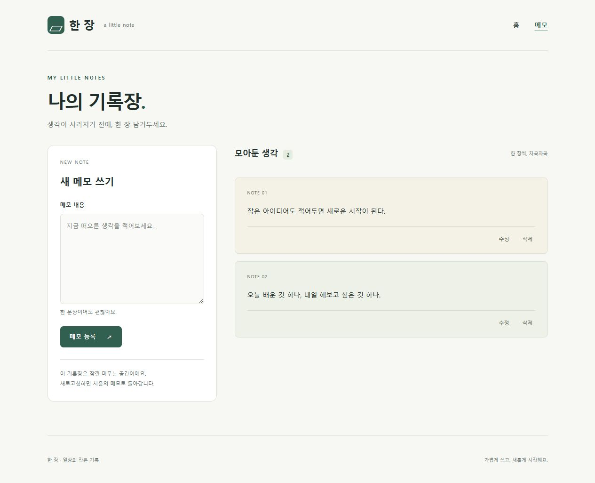

# 한 장 · Next.js 메모 앱

Codemit 2026-10-08 「Next.js 메모 앱과 Git 브랜치 협업 완성하기」의 필수 결과물입니다.
홈 숫자 증가·초기화, 메모 등록·수정·삭제, 두 clone의 GitHub Flow 실습을 제공합니다.
메모는 **React state**에만 저장되며 새로고침하면 초기 메모 2개로 돌아오는 것이 정상입니다.

- [필수 20개 검토](docs/checklist-review.md)
- [Git 작업 기록과 원본 PR](GIT_WORK.md)
- [Git 명령 전체 실제 출력](docs/git-transcript.md)
- [프로덕션 브라우저 검증 17개](docs/ui-validation.json)

## 설치와 실행 — Windows CMD

Node.js 20.9 이상과 npm이 필요합니다. 검증 환경은 Node.js 24.20.0 / npm 11.19.0입니다.

```cmd
git clone https://github.com/gkacksdnjs22-stack/codemit-next-practice-day05.git
cd codemit-next-practice-day05
npm ci
npm run dev
```

http://localhost:3000 과 http://localhost:3000/notes 에 접속합니다.
ZIP은 압축 해제한 `next-practice` 폴더에서 `npm ci`부터 실행합니다.
DB, Flask, 로그인 계정, 환경 변수는 필요하지 않습니다.
개발 서버를 Ctrl+C로 종료한 뒤 프로덕션을 실행합니다.

```cmd
npm run lint
npm run build
npm run start
```

3000번 포트가 사용 중이면 `npm run start -- --hostname 127.0.0.1 --port 5300`을 사용합니다.
실제 검증은 이 명령과 http://127.0.0.1:5300 에서 진행했습니다. 종료는 Ctrl+C입니다.
`node_modules`, `.next`, `.git`, `.env`, 비밀번호·토큰·가상환경은 ZIP에서 제외합니다.

## 시작 자료와 직접 구현한 부분

공식 create-next-app으로 JavaScript, App Router, ESLint, npm을 선택했습니다.

```cmd
npx --yes create-next-app@latest next-practice --js --app --eslint --no-tailwind --no-src-dir --import-alias "@/*" --use-npm --disable-git --yes
```

생성된 기본 화면을 개발 서버에서 실행하여 “To get started, edit the page.js file.”을 확인한 뒤 수정했습니다.
Next.js 16.4.0 / React 19.3.0은 package-lock.json으로 고정됩니다.
홈·공통 레이아웃·Counter·Notes·CSS·문서·Git 실습은 직접 구성했습니다.
수업의 별도 시작 코드는 사용하지 않았으며 AI 코딩 도구로 구현과 검증을 보조했습니다.
시스템 글꼴과 CSS를 사용하여 외부 폰트/이미지 다운로드 없이 빌드됩니다.

## 파일과 개념

Next.js는 React로 화면을 만드는 프레임워크입니다. React의 컴포넌트와 state 위에
파일 기반 라우팅, 서버 렌더링, 프로덕션 빌드 기능을 제공합니다.

| 파일 | 역할 |
|---|---|
| `app/layout.js` | 공통 html/body·한국어·헤더·홈/메모 Link·푸터·children 배치 |
| `app/page.js` | `/` 홈 화면과 Counter 연결 |
| `app/notes/page.js` | `/notes` 제목과 Notes 연결 |
| `components/Counter.js` | 숫자 useState, 함수형 +1, 0으로 초기화 |
| `components/Notes.js` | 메모/입력/수정 ID/삭제 ID state와 CRUD·확인창 |
| `app/globals.css` | 공통 스타일, 반응형 배치, 키보드 포커스 |

`page.js`는 특정 URL의 화면이고 `layout.js`는 여러 페이지가 공유하는 화면입니다.
둘은 기본 Server Component로 유지했습니다. Counter와 Notes에만 `"use client"`를 붙였습니다.
useState와 입력/클릭 이벤트, 브라우저 UUID와 dialog를 사용하므로 Client Component 경계가 필요합니다.
Client Component도 최초 HTML을 서버에서 만들 수 있고 브라우저 hydration 후 이벤트가 연결됩니다.

목록은 `notes.map()`으로 표시하고 `note.id`를 key로 사용합니다.
초기 ID는 initial-1/initial-2, 새 ID는 제출 이벤트에서 crypto.randomUUID()로 생성합니다.
화면의 NOTE 번호는 표시 순서이며, 수정과 삭제는 내용이나 순서가 아닌 ID로 처리합니다.
수정은 ID를 비교한 map, 삭제는 ID를 비교한 filter를 사용합니다.
폼의 입력은 state로 관리하고 저장 전에는 원본 배열을 바꾸지 않습니다.
빈 값/공백은 trim 후 거절하여 원본을 보존하고 안내를 표시합니다.
삭제 확인창은 대상 내용을 표시하고 취소 버튼을 먼저 포커스합니다. Escape도 취소입니다.
수정 대상을 삭제하면 등록 폼으로 돌아오며 다른 메모를 삭제하면 수정 중인 입력은 유지됩니다.

state는 현재 컴포넌트 메모리에 있습니다. 새로고침으로 새 컴포넌트를 만들면 초기 배열을 다시 사용합니다.
DB 저장은 서버의 저장 값을 재조회하므로 새로고침 뒤에도 유지됩니다.
필수 과제에 맞게 localStorage나 DB를 사용하지 않았습니다.

## 실제 확인 결과

2026-10-08 한국 시간, 개발 서버 종료 후 npm run build 성공과 npm run start 실행을 확인했습니다.
[빌드 출력](docs/build-output.txt), [시작 출력](docs/start-output.txt),
[브라우저 검증 JSON](docs/ui-validation.json)에 실제 결과를 남겼습니다.

프로덕션에서 숫자 0→1→2와 초기화, Link 양방향 이동, 빈 값/공백 등록 거절,
같은 내용 두 개의 서로 다른 ID, 기존 수정 값, 수정 취소, 공백 수정 거절,
한쪽만 수정, 삭제 확인·취소·확정, 수정 대상 삭제 시 폼 초기화, 다른 대상 삭제 시 입력 보존,
전체 삭제 후 빈 안내, 새로고침 초기 2개 복원, 콘솔 오류 없음까지 **17항목 PASS**였습니다.

Git 실습의 PR 3개도 모두 Merged입니다. 두 clone의 최종 main은
`93b0e486e4b524076d75262399f5138e97d76655`로 같습니다.
선택 심화 4개는 미선택입니다. [필수 20개 근거](docs/checklist-review.md)를 확인할 수 있습니다.

원격 저장소를 새 폴더에 clone한 뒤 `npm ci`, `npm run lint`, `npm run build`도 모두 성공했습니다.
기존 node_modules나 빌드 캐시를 복사하지 않았습니다. [새 설치 실제 출력](docs/reproduction-output.txt)을 첨부합니다.



## 참고와 의존성 검토

- [Next.js 공식 설치](https://nextjs.org/docs/app/getting-started/installation)
- [페이지와 레이아웃](https://nextjs.org/docs/app/getting-started/layouts-and-pages)
- [Server/Client Components](https://nextjs.org/docs/app/getting-started/server-and-client-components)
- [GitHub Flow 공식 설명](https://docs.github.com/en/get-started/using-github/github-flow)

런타임 의존성 감사는 취약점 0건입니다. 생성 도구의 개발용 ESLint 의존성 braces에는 감사 경고가 남습니다.
일반 npm audit fix로 해결되지 않고 force는 Next.js 14용 설정으로 강등하므로 적용하지 않았습니다.
ESLint는 런타임에 사용하지 않습니다. 감사 원본은 docs/dependency-audit.json에 있습니다.
